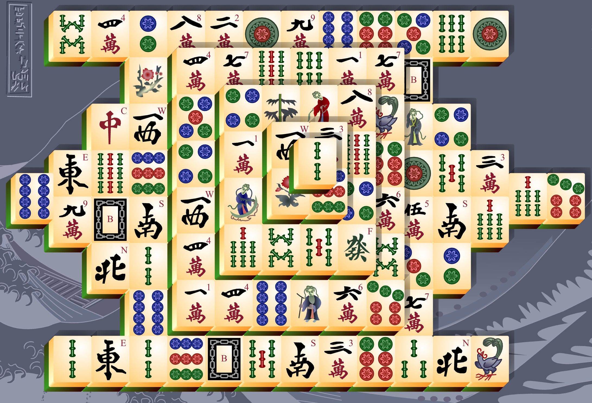

# [Open Mahjong Online](https://www.mahjongonline.cc/)

An open-source online Mahjong game built with Next.js and modern web technologies. Play Mahjong online in a beautiful, responsive interface. We use [ruffle](https://ruffle.rs/) to load flash game to make flash game compatible with modern browsers.

- [Play Mahjong online](https://www.mahjongonline.cc/)
- [Mahjong swf file](https://cdn.mahjongonline.cc/resources/mahjong.swf)

[](https://www.mahjongonline.cc/)

## Game rules

- A tile is considered open or exposed when it can be moved either left or right without disturbing other tiles`,
- Match and remove open pairs of identical tiles from the board`,
- Any two seasons can form a pair, as can any two flowers`,
- The game ends when no legal moves can be made`,

## Features

- 🎮 Multiple Mahjong game variants support(in progress)
- 🎨 Beautiful UI with Shadcn UI components
- 🌓 Dark/Light theme support
- 🌍 Multi-language support (in progress)
- 📱 Responsive design for all devices
- 💬 Player review system

## Tech Stack

- **Framework**: Next.js 14
- **Styling**: Tailwind CSS
- **UI Components**: Shadcn UI
- **Icons**: Lucide React
- **Theme**: Next-themes
- **Analytics**: Vercel Analytics

## Prerequisites

Before you begin, ensure you have the following installed:
- Node.js (v18 or higher)
- npm or yarn

## Installation

1. Clone the repository:
```bash
git clone https://github.com/yourusername/mahjong.git
cd mahjong
```

2. Install dependencies:
```bash
npm install
```

3. Run the development server:
```bash
npm run dev
```

Open [http://localhost:3000](http://localhost:3000) with your browser to see the result.

## Project Structure

```
mahjong/
├── app/                # Next.js app directory
├── components/         # Reusable UI components
├── public/            # Static assets
└── styles/           # Global styles
```

## Development

To start the development server:

```bash
npm run dev
```

Other available commands:
- `npm run build` - Build the production application
- `npm run start` - Start a production server
- `npm run lint` - Run ESLint

## Contributing

Contributions are welcome! Please feel free to submit a Pull Request.

## TODO

- [ ] Game switch functionality
- [ ] Review schema implementation
- [ ] Twitter review integration
- [ ] Enhanced language support

## Credits

- UI Template references:
  - [Play NextJS Template](https://github.com/NextJSTemplates/play-nextjs)
  - [Next Free AI Tools](https://github.com/lixwen/next-freeaitools)

## License

This project is open source and available under the [MIT License](LICENSE).
